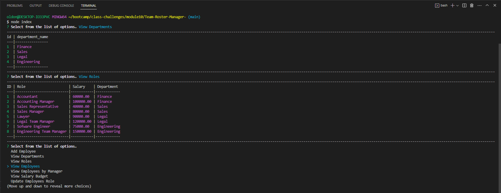

# Team-Roster-Manager-

## 
  
# Table of Contents:
  
  1. [Description](#description)
  2. [Installation](#installation)
  3. [Usage](#usage)
  4. [Contributors](#contributors)
  5. [License](#license)
  6. [Screenshot](#screenshot)
  7. [Link](#link)
  8. [Tests](#tests)
  9. [Questions](#questions)
 10. [Citing Credit](#citing)
  
## Description 

   This is a tool to manage a database of team members included in a institution or work place enviorment, you can add departments, employees, and roles. You may also view, delete, or update them per the users needs.

      
## Installation 

To install this application you will needs to run an Npm install command to install all needed packages after cloning it from github, then you will need to enter your mysql server login information to the connection.js file so the queries are able to execute. Then you will needs to source the scema file to set up the initial database. There is a seeds file provided with mock up data that you can source as well to test the software out before you use it for any real world use. To start the application after sourcing everything just run node index.js in the command line from the Team-Roster-Manager directory

## Usage 

  
  This will be useful for anyone needs to manage a roster of people for any project, or work enviorment. You simply navigate the command line interface and select the options given and follow the prompting when the applications calls for it.

      
  
## Contributors 

 ttieman
  
## License 

  ### This application is covered under the [MIT LICENSE](https://opensource.org/licenses/MIT),
  and should be referred to for any questions about legal licensure considering 
  this application. 

## ScreenShot  

## Link

Vide Demonstration: [https://drive.google.com/file/d/1c_RwqZKCCoWVcZC0cCoYpD7aa6vc1mYr/view](https://drive.google.com/file/d/1c_RwqZKCCoWVcZC0cCoYpD7aa6vc1mYr/view)

To the Repo:
[https://github.com/ttieman/Team-Roster-Manager-](https://github.com/ttieman/Team-Roster-Manager-)  
  
  
## Tests 

### The tests ran for this application were done through user experience.
  
## Questions 

  
### If you have and questions my git hub user is [ttieman](https://github.com/ttieman)
  
### My email is tiemantanner@gmail.com if you wish to reach out to me directly.

## Citing Credit

 Web3 schools was used for referencing javascript elements while building this application!

 [https://www.w3schools.com/](https://www.w3schools.com/)

 The inquirer documentation and module were used to build this application.

 [https://github.com/SBoudrias/Inquirer.js](https://github.com/SBoudrias/Inquirer.js)

 MySql2 was used to make this application and the documentation can be found here.

 [https://www.npmjs.com/package/mysql2](https://www.npmjs.com/package/mysql2)

